```{r setup, include=FALSE}
knitr::opts_chunk$set(echo = FALSE)
knitr::opts_chunk$set(message = FALSE)
knitr::opts_chunk$set(warning = FALSE)
```

# Final project  

**Differential Regulation Network-based Quantification and Prioritization of Key Genes Underlying Cancer Drug Resistence Based on Time-course RNA-Seq Data**

https://doi.org/10.1371/journal.pcbi.1007435

## Introduction  

This project is based on the article from Zhang et.al. Different glioma cell lines are treated with an cAMP activator dbcAMP. Through experiments, cell line LN18 shows resistance to the drug and DBTRG is sensitive. Samples are collected at 0h, 6h, 12h, 24h and 48h after treatment.

The hypothesis is do gene expression profiles differ based on the two time-course RNA-seq data between drug-sensitive and resistant cell lines.

In the article, untested cell line U87 is used as test set after analyzing the difference between the two cell lines. In this project, I mainly focus on the tested DBTRG and LN18 cells.

## Method  

### Library Preparation  

The RNA-Seq data is generated by Dr. Xingcheng Liu, who help culture cell, prepare the RNA library and get sequencing data. The name can be found on the NCBI RNA data website and also in the Ackwonledge section.

Beads containing oligo (dT) were used to isolate poly(A) mRNA from total RNA. Purified mRNA was then fragmented in fragmentation buffer. Using these short fragments as templates, random hexamer-primers ere used to synthesize the first-strand cDNA. The second-strand cDNA was synthesized using buffer, dNTPs, RNase H and DNA polymerase I. Short double-stranded cDNA fragments were purified with a QIAquick PCR extraction kit (vendor) and eluted with EB buffer for end repair and the addition of an ‘A’ base. 

RNA libraries were prepared for sequencing using standard Illumina protocols. The short fragments were ligated to Illumina sequencing adaptors. DNA fragments of a selected size were gel-purified and amplified by PCR.

### Download RNA-Seq Data  

Cell lines are epithelial brain cancer glioma cells: LN-18, U87 and DBTRG-05MG. They are treated with 1mM cAMP activator dbcAMP and data collected at 0, 12, 24, 36, 48h.  
Accession number: **GSE128722**  

```{r}
Samples <- paste0(rep("SRR87699",15),c(35:49))
Cells <- c(rep("DBTRG",5),rep("U87",5),rep("LN18",5))
Time <- as.character(rep(c(0,6,12,24,48),3))
Info <- data.frame(Samples=Samples, Cells=Cells, Time=Time)
print(Info)
```

Download a summary file that contains all the *SRR* files called **SRR_Acc_List.txt** and retrieve all the *SRR* files via SRAtoolkits. All the *SRR* files are split into 2 files that are pair-end.  

### Quality Control  

Run FastQC on all samples and use multiqc to visualize all the results.

#### Problems encounted:  

1. When use SRA Analysis to see **Taxonomy Analysis**, found that there is a strong signal of Mycoplasma hyorhinis contamination. Although the percentage is not high, it has a high coverage over 50. Other samples also have different extent of contamination, but not with Mycoplasm highest.

2. Check the FastQC report of the first sample and found that there is a very high percentage of duplicated sequence up over 50%. Use NCBI Blast to check the origin of those highly overrepresented reads, results show that they are all from human Mitochondria ATP8 (ATP synthase F0 subunit 8) genes.

By looking for references, Mycoplasmas are notoriously common contamination for cell culture becuase it is so flexible to pass through most filter membranes and can reach a high concentration without cause any disturbance. It has a small genome size (0.6 Mbp) but lack genes for precursors synthesis and energy metabolism. Thus may alter the host's cell biology. In this case, Mycoplasma hyorhinis endonucleases can degrade host cell DNA, providing DNA precursors for the parasite.  
https://www.ncbi.nlm.nih.gov/pmc/articles/PMC4357728/

In terms of PolyA selection, it is very likely to enrich mt-rRNA and mt-mRNA which is also rich of AT.

#### Mutltiqc Results  

- From overrepresented reads results, there are in fact very low overrepresented sequences.

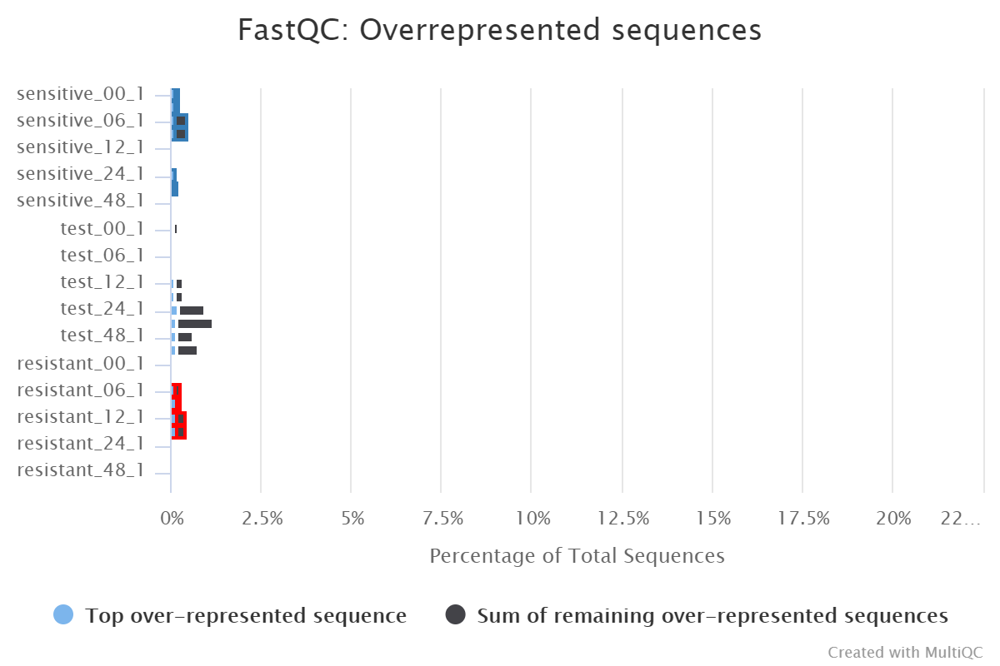

- From *Seqence Counts*, all the samples are nearly of the same level, must all of them have a very high duplication level, over 50%, except one sample **SRR8769949_1**. High duplication level in RNA-seq data is expected because we usually over amplify samples in order to detect low expression genes.

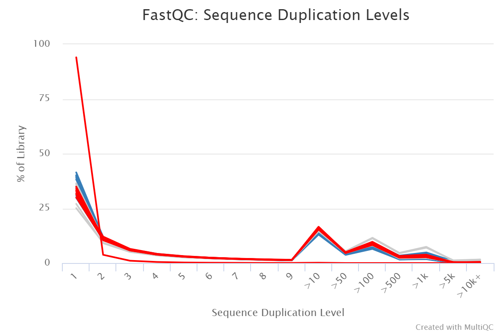

- However from *Mean Quality Scores* I found that **SRR8769949_1** has lower and more fluctuating scores.  

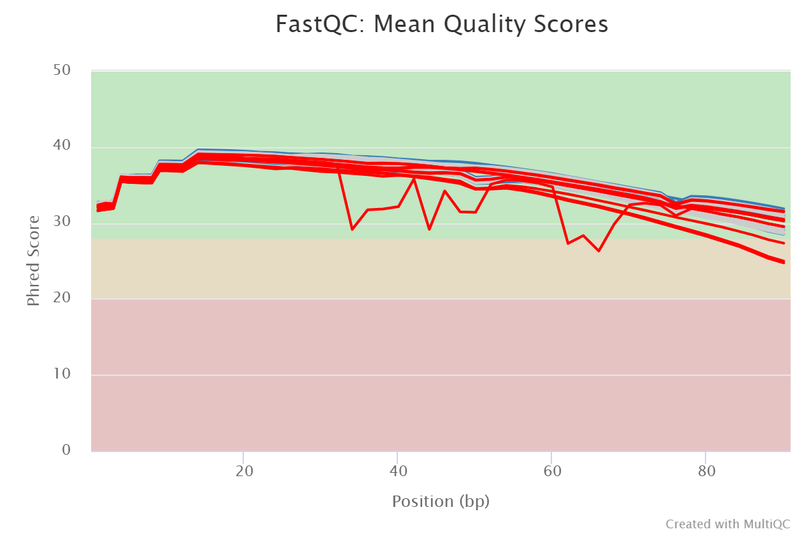

- Also from *Per Sequence Quality Scores* it has minor peak at Phred 33, while others just have one major peak.

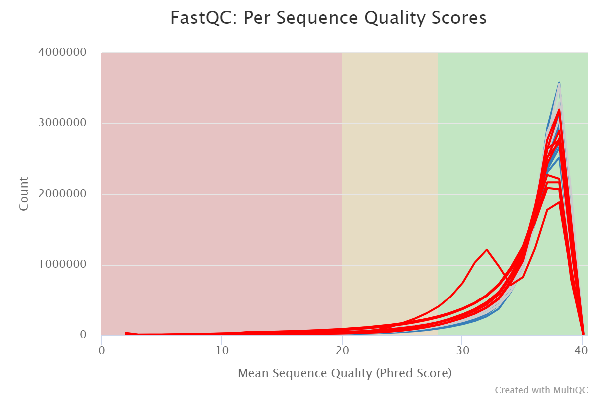

- From *Per Base N content* I saw that sample has tree peaks at 38, 48, 62-64 bp with a percentage of 1.88%. From this aspect, the low quality in some position of **SRR8769949_1** may be caused by the corresponding N content. The minor peak at Phred 33 further verify this, as N base would be assigned a Phred scores as 33.

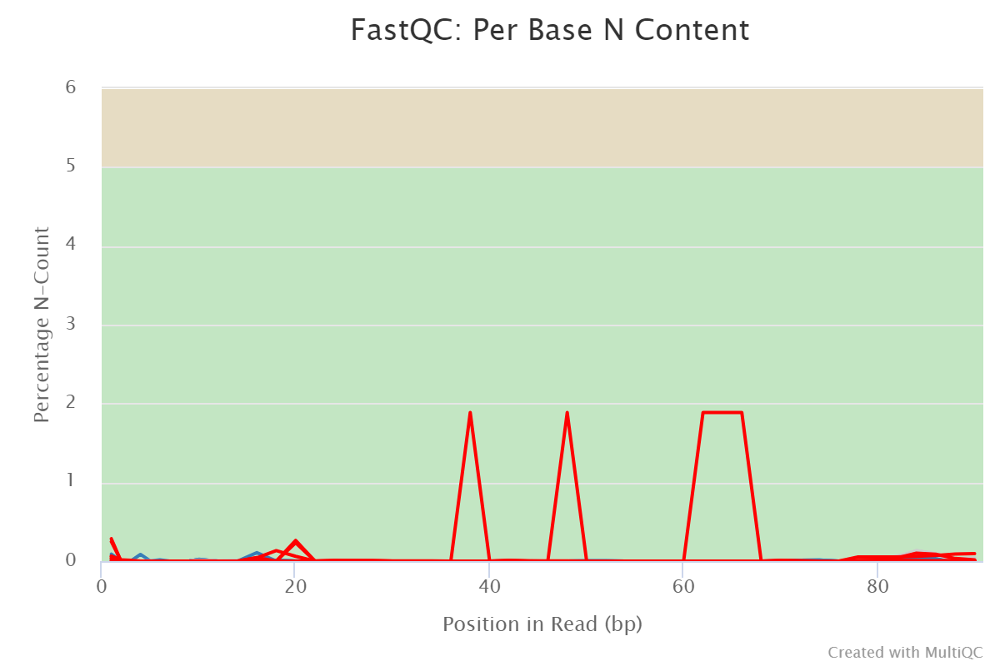

- When checking the tile quality, I obseverd that a section of the flow cells are abnormal, showing a continuous area of red colors, and the area is corresponding to the N bases regions. This indicates that something wrong is on the lanes or sequencer.


### Preprocessing

Use trim_galore to filter out all the low quality reads. If a read have a low mean quality, the mate read would also be dropped.

Here *--paired* indicates trimming sequence in paired mode, which enables trim_galore to check the two paired reads at the same time and if one read are abandoned, the other would be abandoned as well. *--retained* indicates retaining the bandoned reads. *stringency* is set as 10 to only consider a sequence as adaptor when more than 10 bases are overlapped.

To check results after trimming, run FastQC on the trimmed data. Then run multiqc.

### Process results

By a simple trimming step, the contamination and duplicate issue are still there, since we just improve the overall quality of reads. There are improvements on **Per Base Sequence Quality** and **GC content**. It is unnecessary for these samples to perform a trimming step, because there is no adapter detected and the overall quality is high.

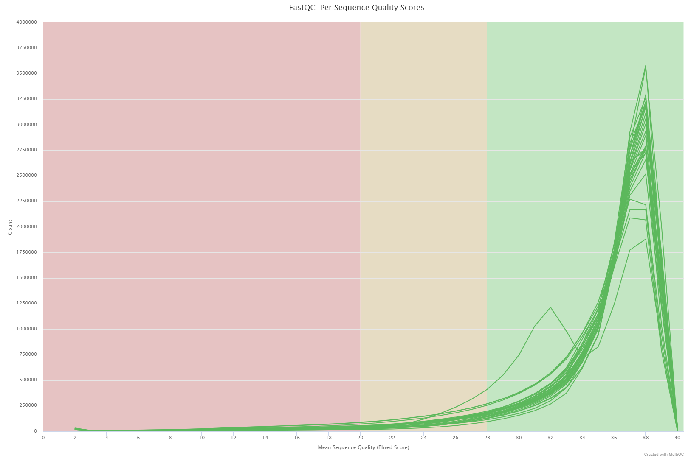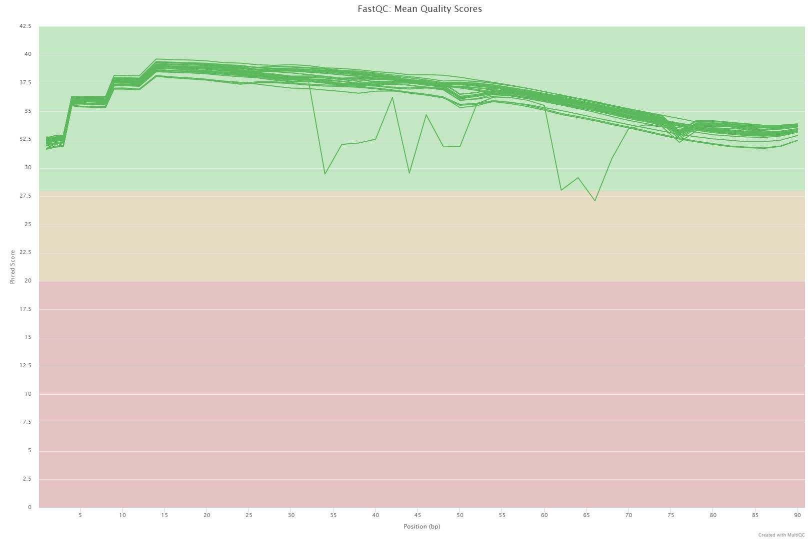

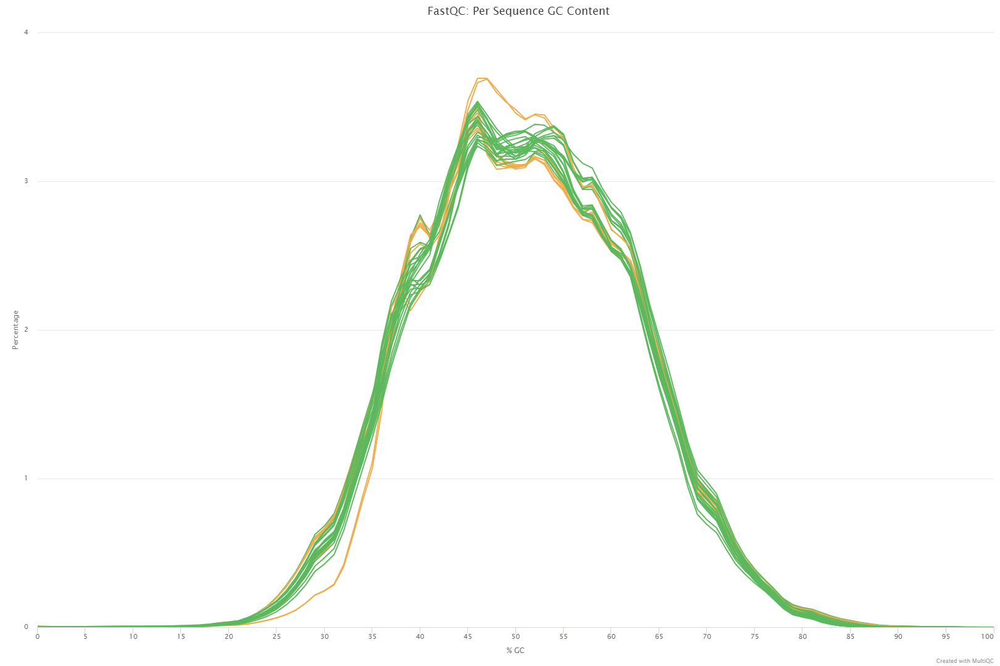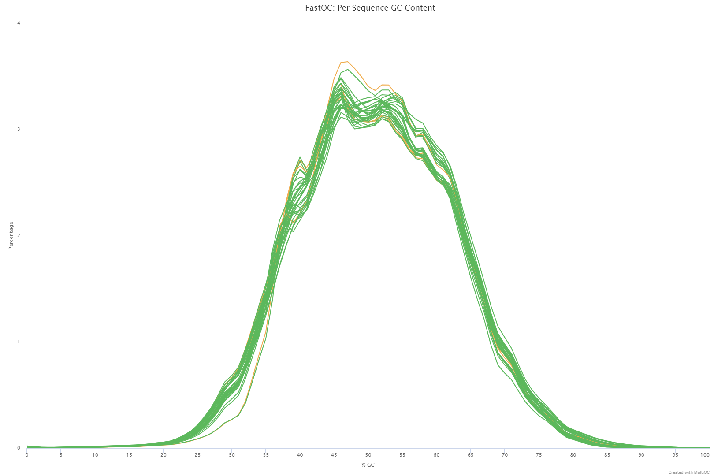

### alignment

Alignemt step is implemented by STAR using default parameters. After alignment, perform alignment QC by RSeQC. Since there is no corresponding BED file in Ensembl, so I generate my own BED file and from gtf annotation and .bai file from .bam file. Then perform read_distribution and geneBody_coverage analysis using RSeQC.

Use multiqc again to inspect the alignment results. Results are shown as below.

We can see from the figure that there are around 2.5M reads assigned to CDS, a small portion compared to the total reads. I think this is enough for downstream analysis thanks to a sequencing depth of 13M for each samples.

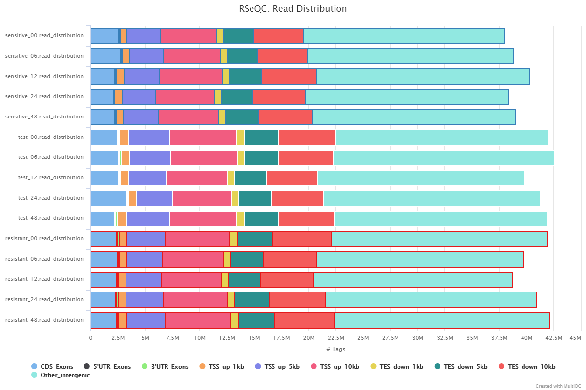

From the gene body coverage figure, there is no 5' and 3' bias, which is great, no severe degredation. 

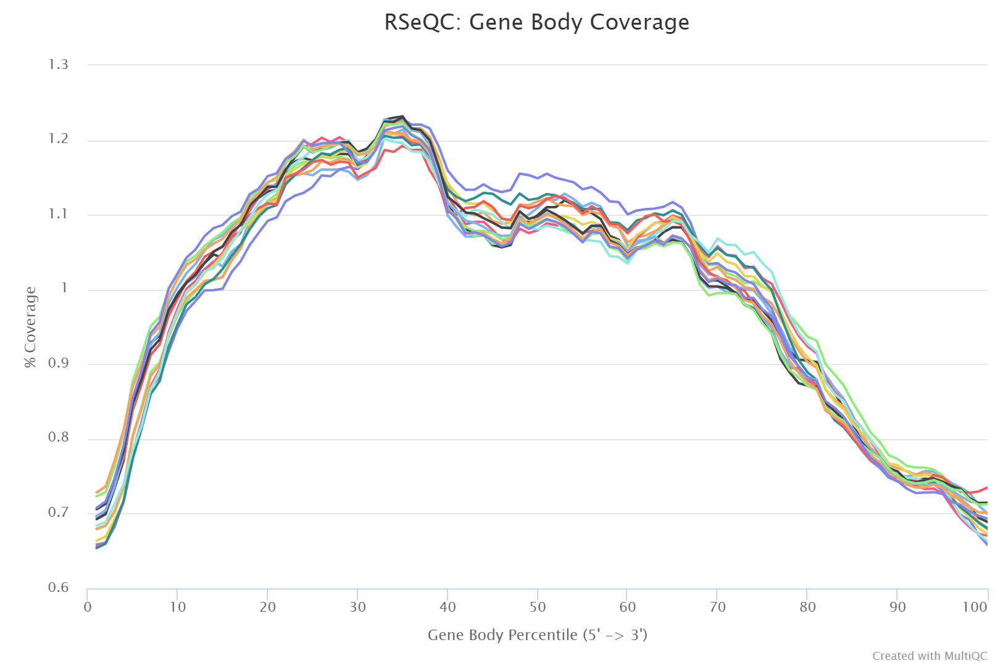

### Feature counts

Use featureCounts to summarize the mapped reads information.

Results shown that all samples has an assigned rate over 76%.

```{r, message=F, echo=F}
library(ggplot2)
library(tidyr)
library(magrittr)
library(dplyr)

summary <- read.csv("./counts.txt.summary", header = T, sep='\t')
samples <- paste0(Cells, "_", rep(c(1:5),3))
colnames(summary) <- c("Status", samples)
summary <- gather(data = summary,
                  key = "samples",
                  value = "Nreads",
                  "DBTRG_1":"LN18_5")
summary <- summary[which(summary$Nreads!=0),]

gene_count <- read.csv("./counts.txt", header = T, sep = '\t')
dim(gene_count)
  
gene_count <- gene_count[,-c(2:6)]
colnames(gene_count) <- c(colnames(gene_count)[1], samples)

gene_count_df <- gather(data = gene_count,
                        key = "samples",
                        value = "Nreads",
                            "DBTRG_1" : "LN18_5")
gene_count_df$cells <- gsub("_[0-9]", "", gene_count_df$samples)
gene_count_df <- gene_count_df[which(gene_count_df$Nreads!=0),]

ggplot(summary, aes(fill=Status,y=Nreads,x=samples)) + geom_bar(position="dodge", stat="identity") + coord_flip() + theme(legend.position = "bottom") + labs(title = "featureCounts Summary Statistics")

mean_read <- gene_count_df %>% group_by(cells) %>% summarise(Nreads = mean(Nreads))

ggplot(mean_read, aes(x=cells, y=Nreads)) + geom_bar(stat = "identity") + labs(title = "Mean Number of Read for Each Cell Lines")

#ggplot(gene_count_df, aes(x=cells, y=Nreads)) + geom_point() + labs(title = "Read Distribution for each")

ggplot(gene_count_df, aes(x=log(Nreads+1), fill=cells))+ geom_histogram(alpha = 0.6, position = "identity") + labs(title = "Read Distribution for each")
```

## Results  

### Heatmap and dendrogram

Get data into DESeq2.

```{r, message=F, echo=F}
library(DESeq2)
library(magrittr)

rownames(gene_count) <- gene_count$Geneid
gene_count <- gene_count[,c(2:16)]
gene_count <- gene_count[rowSums(gene_count)!=0,]

sample_info <- DataFrame(Cells = Info$Cells, Time = Info$Time, row.names = colnames(gene_count))

DESeq.ds <- DESeqDataSetFromMatrix(countData = gene_count,
                                   colData = sample_info,
                                   design = ~ Cells + Time)

DESeq.rlog <- rlog(DESeq.ds, blind = T)

corr_coeff <- cor(assay(DESeq.rlog), method = "pearson")

as.dist(1-corr_coeff) %>% hclust %>% plot(.,labels = colnames(assay(DESeq.rlog)), main = "rlong transformed read counts")

as.dist(1-corr_coeff, upper = T) %>% as.matrix %>% pheatmap::pheatmap(.,main = "Pearson correlation")
```

From the cluster results, we see that the three different cell lines are clustered as three groups correctly, but what is unexpected is in the article, DBTRG and LN18 is the experimental groups, while U87 si the test group. We known that DBTRG is the drug-sensitive cell and the other is the resistant one. From the cluster plot, we see DBTRG and LN18 are clustered together rather than U87 with one of them. Since we hope to see that if U87 is clustered with one of the two experimental cell lines, then we can predict whether the test cell lines U87 is sensitive or resistant. From the plot, the overall expression depends more on cell lines than their drug sensitivity properties.

### PCA

Perform PCA analysis.

```{r, echo=F}
par(mfrow=c(1,2))
plotPCA(DESeq.rlog, intgroup = "Cells") 
plotPCA(DESeq.rlog, intgroup = "Time")

library(biomaRt)
require(org.Hs.eg.db)

symbols <- select(org.Hs.eg.db, rownames(gene_count), c("SYMBOL","GENENAME","ENTREZID"),"ENSEMBL")

#library(pcaExplorer)
#pcaExplorer(dds = DESeq.ds, dst = DESeq.rlog)
```

From the PCA plots we can see that cell lines are the determined factors that seperate samples but not time. Again, since PCA is performed on overall expression, this tells us difference of overall expression is largerly explained by cell lines.

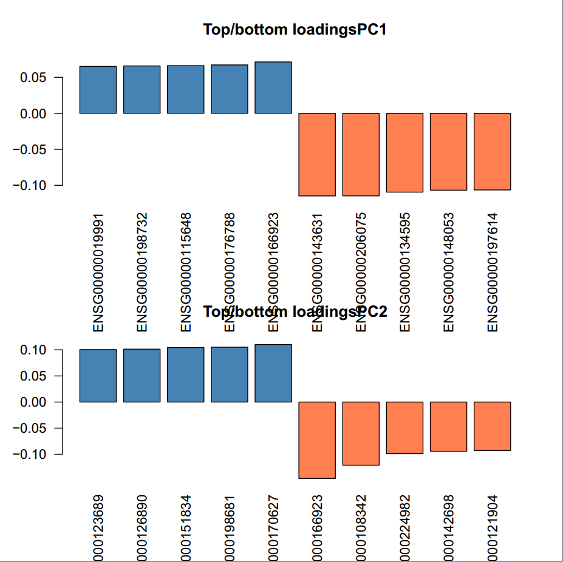

The top loading genes are ENSG00000166923 (gremlin 1, BMP antagonist) for positive coefficient and ENSG00000143631 (filaggrin) for negative.

Gremlin primarily inhibits bone morphogenesis and is implicated in disorders of increased bone formation and several cancers.

Filaggrin is essential for the regulation of epidermal homeostasis.

```{r, eval=F}
library(MASS)
require(gridExtra)
DBTRG <- t(gene_count[,1:5])
pca <- prcomp(DBTRG %*% t(DBTRG))
pca.df <- pca$x[,1:3]
pca.df <- as.data.frame(scale(pca.df))
pca.df$labels <- factor(Time[1:5], level=c("0","6","12","24","48"))

g1 <- ggplot(pca.df, aes(x=PC1, y=PC2)) + geom_point(size = 5, aes(color=labels)) + geom_path() + labs(title = "DBTRG PC1 v.s. PC2")
g2 <- ggplot(pca.df, aes(x=PC1, y=PC3)) + geom_point(size = 5, aes(color=labels)) + geom_path() + labs(title = "DBTRG PC1 v.s. PC3")
grid.arrange(g1, g2, ncol = 2)

LN18 <- t(gene_count[,11:15])
pca <- prcomp(LN18 %*% t(LN18))
pca.df <- pca$x[,1:3]
pca.df <- as.data.frame(scale(pca.df))
pca.df$labels <- factor(Time[1:5], level=c("0","6","12","24","48"))

g1 <- ggplot(pca.df, aes(x=PC1, y=PC2)) + geom_point(size = 5, aes(color=labels)) + geom_path() + labs(title = "LN18 PC1 v.s. PC2")
g2 <- ggplot(pca.df, aes(x=PC1, y=PC3)) + geom_point(size = 5, aes(color=labels)) + geom_path() + labs(title = "LN18 PC1 v.s. PC3")
grid.arrange(g1, g2, ncol = 2)

U87 <- t(gene_count[,6:10])
pca <- prcomp(U87 %*% t(U87))
pca.df <- pca$x[,1:3]
pca.df <- as.data.frame(scale(pca.df))
pca.df$labels <- factor(Time[1:5], level=c("0","6","12","24","48"))

g1 <- ggplot(pca.df, aes(x=PC1, y=PC2)) + geom_point(size = 5, aes(color=labels)) + geom_path() + labs(title = "U87 PC1 v.s. PC2")
g2 <- ggplot(pca.df, aes(x=PC1, y=PC3)) + geom_point(size = 5, aes(color=labels)) + geom_path() + labs(title = "U87 PC1 v.s. PC3")
grid.arrange(g1, g2, ncol = 2)
```

Implement PCA on each cell line, I noticed that the drug resistance can kine of be captured. We can see that as time increasing, the cell status of DBTRG is moving forward, while that of LN18 is moving approach its original position (Time 0).


A similar trend of going closer to the original position can be observed in the test cell line U87.


### TCGs (Temporally Changed Genes) Identifications

Here use the same method as stated in the article. Since the threshold for maximum expression of a gene across time and the minimum fold change between points are designed empirically, and the original article use FPKM as measurement while we use gene counts, we should define them for this analysis. Given that there are totally 20000 genes and 100 - 200 genes are identified as TCG (1%-2%), we try different threshold to gain a similar portion of TCGs.

As I test the parameters in the article, which threshold for maximum expression is 10, and the minimum fold change is 5. Out of 39000 expressed genes, 1100 genes are identified as TCGs for DBTRG, and 1300 genes for LN18, which are near 3%. Since it is not far away from the expected ratio, I adapt this set of parameter for further analysis.

From the expression profiles, we can see that they are quite different between sensitive and resistant cells.


```{r, eval=F}
DESeq.ds <- DESeq(DESeq.ds)
norm.counts <- counts(DESeq.ds, normalized=T)

delta <- 5
epsilon <- 10

TCG <- rep(F, nrow(norm.counts))
for(i in 1:nrow(norm.counts)) {
  if(max(norm.counts[i,1:5])>=epsilon){
    isTCG <- FALSE
    fc <- sort(norm.counts[i,1:5])[5] / sort(norm.counts[i,1:5])[1]
    if(fc > delta) {
      isTCG <- TRUE
    }
    TCG[i] <- isTCG
  }
}
DEG_S <- norm.counts[TCG,1:5]

TCG <- rep(F, nrow(norm.counts))
for(i in 1:nrow(norm.counts)) {
  if(max(norm.counts[i,11:15])>=epsilon){
    isTCG <- FALSE
    fc <- sort(norm.counts[i,11:15])[5] / sort(norm.counts[i,11:15])[1]
    if(fc > delta) {
      isTCG <- TRUE
    }
    TCG[i] <- isTCG
  }
}
DEG_R <- norm.counts[TCG,11:15]

norm.DEG_S <- DEG_S
for(i in 1:nrow(DEG_S)) {
  norm.DEG_S[i,] <- DEG_S[i,] / max(DEG_S[i,])
}
colnames(norm.DEG_S) <- c("0 h", "6 h","12 h", "24 h", "48 h")

norm.DEG_R <- DEG_R
for(i in 1:nrow(DEG_R)) {
  norm.DEG_R[i,] <- DEG_R[i,] / max(DEG_R[i,])
}
colnames(norm.DEG_R) <- c("0 h", "6 h","12 h", "24 h", "48 h")

par(mfrow=c(1,2))
pheatmap::pheatmap(norm.DEG_S, main = "Expression Profile of DBTRG TCGs", show_rownames = F, cluster_cols = F)
pheatmap::pheatmap(norm.DEG_R, main = "Expression Profile of LN18 TCGs", show_rownames = F, cluster_cols = F)
```

I cluster TCGs using the hierarchical clustering result above for both sensitive and resistant cells. We can see that the effect of going back to the original expression level could be observed in resistant cells, while these effect is less obvious in sensitive cells. Although there is kind of bounding back phenomenon in sensitive cells, the final expression level is more away from the starting point than those of resistant cells.


### Measurement of Monotonicity and Adaption

To more clearly see the effect bounding back of resistant cells (adaption), we define monotonicity which measures how the ending point is compared to the max point, and adaption which measures how the overall change (difference between start point and end point) is compared to the max deviation from start point.

From the figure, we do see there are more points with higher adaptive scores for resistant cells, while most of them show strong monotonicity.


This could be clearly see from the plots below.


However the difference on adaptive scores between the two cell lines could not be captured when performaing Wilcox test. No significance is shown on adaptive scores but on monotonic scores.


```{r, eval=F}
S_A=apply((abs(DEG_S-DEG_S[,1])),1,max)/(abs(DEG_S[,5]-DEG_S[,1])+0.1)  # Adaptation
S_M=abs(DEG_S[,5]-DEG_S[,1])/apply(DEG_S,1,max)  # Monotonicity

R_A=apply((DEG_R-DEG_R[,1]),1,max)/(abs(DEG_R[,5]-DEG_R[,1])+0.1)  # Adaptation
R_M=abs(DEG_R[,5]-DEG_R[,1])/apply(DEG_R,1,max)  # Monotonicity

S_A_M = cbind(S_A[-which.max(S_A)], S_M[-which.max(S_A)])
R_A_M = cbind(R_A[-which.max(R_A)], R_M[-which.max(R_A)])

dev.new()
plot((S_A_M), pch = 23, col = "aquamarine3", cex = 1, xlab= "Adaptive response", ylab= "Monotoic response")
par(new=T) 
plot((R_A_M), pch = 21, col = "darkgoldenrod",  cex = 1.5, xlab= "", ylab= "")
#althogh this plot could not really distinguish the two curve, but shows that resistant one has a tail against the adaption score.
```

```{r, eval=F}
par(mfrow=c(1,2))
plot(S_A[-which.max(S_A)], ylim=c(0,max(S_A[-which.max(S_A)], R_A[-which.max(R_A)])+100))
plot(R_A[-which.max(R_A)], ylim=c(0,max(S_A[-which.max(S_A)], R_A[-which.max(R_A)])+100))

par(mfrow=c(1,2))
hist(S_A[-which.max(S_A)])
hist(R_A[-which.max(R_A)])

par(mfrow=c(1,2))
h <- hist(log(R_A[-which.max(R_A)], base=20))
hist(log(S_A[-which.max(S_A)], base=20), breaks = h$breaks)

```

```{r, eval=F}
S_A.scaled = log(S_A[-which.max(S_A)], base=20)
R_A.scaled = log(R_A[-which.max(R_A)], base=20)

dataset_A <- data.frame(value = c(S_A.scaled, R_A.scaled), group = factor(rep(c("Sensitive TCGs","Resistant TCGs"), times = c(length(S_A.scaled), length(R_A.scaled)))))
boxplot( t(value) ~ t(group),  notch = F, dataset_A, outline = FALSE, border = c("darkgoldenrod","aquamarine3"),cex = 1, ylab= "Adaptive response", cex.axis=1,pars = list(boxwex = 0.5, staplewex = 0.5, outwex = 0.5))  #,col.axis = "#009E73"

wilcox.test(S_A,R_A,alternative="less")  # Wilcoxon signed rank test with continuity correction;

dataset_M <- data.frame(value = c(S_M[-which.max(S_A)],R_M[-which.max(R_A)]), group = factor(rep(c("Sensitive TCGs","Resistant TCGs"), times = c(length(R_M)-1, length(S_M)-1))))
boxplot( t(value) ~ t(group),  notch = F, dataset_M, outline = FALSE, border = c( "darkgoldenrod","aquamarine3"), cex = 1,  ylab= "Monotonic response", cex.axis=1,pars = list(boxwex = 0.5, staplewex = 0.5, outwex = 0.5))  #,col.axis = "#009E73"

wilcox.test(S_M,R_M,alternative="greater")  # Wilcoxon signed rank test with continuity correction;

#boxplots cannot capture the taling effect on R_A
```

```{r, eval=F}
#this chuck just for inspecting the clustering effect
#Cluster after interpolation, curves are smoother and thus better clustering
c <- read.csv('clusters_Matlab.csv', header = F)
table(c)
cls1 <- norm.DEG_S[c==3,]
write.table(rownames(cls1), file = 'cls1_genes_ENSG.txt', col.names = F, row.names = F, quote = F)
#Use UCFC gene ID converter to get Gene symbol

#GO anaylsis use GOrilla
#results show that cluster 1 is enriched in immune system and cell cortex

#changing rate
R <- matrix(0, nrow = nrow(cls1), ncol = 4)
R[,1] <- abs(cls1[,2] - cls1[,1]) / 6
R[,2] <- abs(cls1[,3] - cls1[,2]) / 6
R[,3] <- abs(cls1[,4] - cls1[,3]) / 12
R[,4] <- abs(cls1[,5] - cls1[,4]) / 24
#The max is unrecognized SYMBOL, novel transcript, the second max is HOX3
```

### Network Modeling

Implement gene-wise correlation test to each gene pair in both sensitive and resistant cells.

```{r, eval=F}
length(intersect(rownames(DEG_S),rownames(DEG_R)))
TCGs <- as.character(union(rownames(DEG_S), rownames(DEG_R)))
norm.TCG_S <- norm.counts[TCGs, 1:5]
norm.TCG_R <- norm.counts[TCGs, 11:15]

for(i in 1:nrow(norm.TCG_S)) {
  norm.TCG_S[i,] <- norm.TCG_S[i,] / max(norm.TCG_S[i,]+0.1)
}
colnames(norm.TCG_S) <- c("0 h", "6 h","12 h", "24 h", "48 h")

for(i in 1:nrow(norm.TCG_R)) {
  norm.TCG_R[i,] <- norm.TCG_R[i,] / max(norm.TCG_R[i,]+0.1)
}
colnames(norm.TCG_R) <- c("0 h", "6 h","12 h", "24 h", "48 h")

write.csv(norm.TCG_S, file = 'Net_TCG_S.csv')
write.csv(norm.TCG_R, file = 'Net_TCG_R.csv')
```

```{r, eval=F}
library(biomaRt)
mart <- useDataset("hsapiens_gene_ensembl", useMart("ensembl"))
G_list <- getBM(filters = "ensembl_gene_id", attributes = c("ensembl_gene_id","hgnc_symbol"), values = TCGs, mart = mart)
#which(duplicated(G_list$ensembl_gene_id)==T)
#1486 CCL3L1
#Through STRING query, CCL3L3 is more commonly used
G_list <- G_list[-(which(duplicated(G_list$ensembl_gene_id)==T)-1),]
G_list_filtered <- G_list[-which(G_list$hgnc_symbol==""),]
#store G_list_filtered and use to attain PPI
```

Transform TCGs gene ID into HGNC symbols, use the list of these symbols (proteins) to gain protein-protein interaction on STRING website. Based on the PPI data, correlation coefficients and pvals, construct gene interaction network.

```{r, eval=F}
#Data attained from STRING
TCGs <- read.table("Net_genes.csv", header = F)
PPI <- read.csv("string_interactions.tsv", sep = '\t')
PPI <- PPI[,1:2]
Net_genes <- union(PPI[,1], PPI[,2])
remove <- which(Net_genes %in% TCGs$V2==FALSE)
Net_size <- length(Net_genes)

Interact_mat <- matrix(0, Net_size, Net_size)
rownames(Interact_mat) <- Net_genes
colnames(Interact_mat) <- Net_genes
for(i in 1:nrow(PPI)) {
  Interact_mat[PPI[i,1],PPI[i,2]] = 1
}
Interact_mat <- Interact_mat[-remove, -remove]

Net_genes <- Net_genes[-remove]
Net_size <- length(Net_genes)

#Data interpolated

TCG1 <- t(read.csv('Net_TCG_S_interpolated.csv', header = F))
TCG2 <- t(read.csv('Net_TCG_R_interpolated.csv', header = F))
rownames(G_list) <- G_list$ensembl_gene_id
colnames(TCG1) <- G_list[TCGs,]$hgnc_symbol
colnames(TCG2) <- colnames(TCG1)

TCG1 <- TCG1[,Net_genes]
TCG2 <- TCG2[,Net_genes]
TCG1 <- TCG1[,-which(colSums(TCG1)==0)]
TCG2 <- TCG2[,-which(colSums(TCG2)==0)]

cor_S <- matrix(0, ncol(TCG1), ncol(TCG1))
ppval_S <- cor_S
cor_R <- matrix(0, ncol(TCG2), ncol(TCG2))
ppval_R <- cor_S

for(i in 1:ncol(TCG1)) {
  for(j in 1:ncol(TCG1)){
    partial_test <- cor.test(TCG1[,i], TCG1[,j], method = 'pearson')
    cor_S[i,j] <- partial_test$estimate
    ppval_S[i,j] <- partial_test$p.value
  }
}

for(i in 1:ncol(TCG2)) {
  for(j in 1:ncol(TCG2)){
    partial_test <- cor.test(TCG2[,i], TCG2[,j], method = 'pearson')
    cor_R[i,j] <- partial_test$estimate
    ppval_R[i,j] <- partial_test$p.value
  }
}

edge_S <- matrix(0, ncol(TCG1), ncol(TCG1))
colnames(edge_S) <- colnames(TCG1)
rownames(edge_S) <- colnames(TCG1)
for (i in 1:ncol(TCG1)){
  for (j in 1:ncol(TCG1)){
    if (cor_S[i,j]>0.75 & ppval_S[i,j]*choose(ncol(TCG1),2)<0.05 & Interact_mat[colnames(TCG1)[i],colnames(TCG1)[j]]==1)
      edge_S[i,j]=1
    else if (cor_S[i,j]<-0.75 & ppval_S[i,j]*choose(ncol(TCG1),2)<0.05 & Interact_mat[colnames(TCG1)[i],colnames(TCG1)[j]]==1)
      edge_S[i,j]=-1
  }
}

edge_R <- matrix(0, ncol(TCG2), ncol(TCG2))
colnames(edge_R) <- colnames(TCG2)
rownames(edge_R) <- colnames(TCG2)
for (i in 1:ncol(TCG2)){
  for (j in 1:ncol(TCG2)){
    if (cor_R[i,j]>0.75 & ppval_R[i,j]*choose(ncol(TCG2),2)<0.05 & Interact_mat[colnames(TCG2)[i],colnames(TCG2)[j]]==1)
      edge_R[i,j]=1
    else if (cor_R[i,j]<-0.75 & ppval_R[i,j]*choose(ncol(TCG2),2)<0.01 & Interact_mat[colnames(TCG2)[i],colnames(TCG2)[j]]==1)
      edge_R[i,j]=-1
  }
}

sum(edge_S!=0)
sum(edge_R!=0)

edge_S <- edge_S[which(rowSds(edge_S)!=0), which(rowSds(edge_S)!=0)] #710
edge_R <- edge_R[which(rowSds(edge_R)!=0), which(rowSds(edge_R)!=0)] #611

#edge_S and edge_R are saved for further analysis
```

After network building, degree of node are calculated for both network and plot histogram to show their distributions. From the figure, we can't see that there is more high degree nodes in resistant network.


```{r, eval=F}
library(igraph)
#ignore direction
edge_S[which(edge_S == -1)] = 1
edge_R[which(edge_R == -1)] = 1

net_S <- graph_from_adjacency_matrix(edge_S, diag = F, mode="undirected")
deg_S <- degree(net_S, mode="all")

net_R <- graph_from_adjacency_matrix(edge_R, diag = F, mode="undirected")
deg_R <- degree(net_R, mode="all")

par(mfrow=c(1,2))
h <- hist(deg_S, main="Histogram of s_net node degree")
hist(deg_R, breaks = h$breaks, main="Histogram of r_net node degree")

mean(deg_S)
mean(deg_R)
```

## Discussion

Although at first the contamination and overrepresented reads bothered me, when inspecting the alignment summary, there are in fact high mapping rate across all samples. Those 3-4% unmapped may due to the contaminous Mycoplasma and the duplicates only take up around 1%. A BWA mapping is better implemented on the Mycoplasma reference genome to see the influence of contamination.

The problemetic resistant_48_1 (SRR8769949_1) has a relative high N content at ceratin positions, that why it has a low duplicate level and overall lower quality. However this problem is produced by the machine itself and there is something wrong with the lanes. It doesn't not influence the mapping when comparing the mapping rate, read depth and coverage with others. STAR would treat this N bases as mismatch and could still be able to deal with those, according to STAR default setting that minimum overlap is 3 bases.

From the PCA on the whole samples, cells are correctly grouped by their cell lines but not by time course. This can be explained by the the fact that different cell lines act differently to the drug treatment, that surely they would not clustered together. More importantly, the expression profile is like a characteristic of cell lines, each cell line has its own profile due to the micro-environment around, and only a small portion of genes would be greatly affected by the treatment. This effect could be obscured by tiny change of other genes. That is why we should try to find out genes that most likely be responsible to the drug resistance.

From PCA on each cell lines, we can see how state changes across time and observe the bounding back tendency of resistant cells. The PCA step resembles picking up the first few genes that can represent the whole gene set. While it somewhat has an effect of finding the responsible genes, it still represents the whole gene set and thus, more rubust than the exact resistant genes. This is the easier way we observe different pattern between sensitive and resistant cells, but it is still not obvious.

The idea of finding TCGs is based on knowledge that genes targeted by the drug and genes that regulate them are among the most likely to be changed. So through setting expression threshold and fold change filtering conditions, TCGs are selected and clustering method followed to show clearer profiles of the rubustness in resistant cells.

The author defines two formula to measure monotinicity and adaption (robustness) of the two cell lines. I tried the same method and didn't get a good figure as that in the article. It turns out that they made a mistake in their codes by mixing up sensitive and resistant cells. In fact, my results show that sensitive cells do show a stronger monotinicity however the adaptive effect is not significantly different between the two groups. By simple plotting, we do see resistant cells tend to have more genes that have higher adaption scores, but is just a little higher and only take up a small portion. I think this may due to the definition of adaption score, which would be extremely large when there is almost no change across 48h. A better measurement or scaling strategy should be considered.

In the original article, the author continues to construct networks and measure the complexity of them. They did a good job by integrating PPI knowledge with statistical test. However, they claim that they define positive coefficient as enhancing effect and negative one as inhibiting effect, which seems reasonable. I don't think the regulatory relationship could be decided by this way, as the protein interaction doesn't necessarily means that their genes are regulated as the way that coefficients indicate, not to mention they further use this reconstruct network to count how many feedbacks are in the network and thus measure the robustness.

So I build the network and ignore the sign of coefficient, every gene pair that has a coefficient larger than 0.75, smaller than a 0.05 cutoff and show interaction in PPI would be linked together. Degree of nodes in both network are calculated but I don't expect that results show sensitive network have a higher number of high degree nodes than resistant. This happened when those PPI genes are not well correlated with each other, and the reason may be that performing linear regression on time-course data is not a good idea, since the expression of a gene across time would always not be normal.

## Conclusion

Gene expression profiles are different between drug-sensitive and -resistant cells. There is tendency of bounding back to the orignial expression level in resistant cells.

In this project, I performed quality control on all samples and tried to assess their availability. Think carefully about the influence of contamination and overrepreseted sequence. Use exploratory methods to inspect data including PCA, clustering and heatmap. Design methods to evaluate the effect of resistance, including PCA, clustering and time-course expression profiles. 

Although so far not successful, try to use Monotonicity scores and adaptive scores to distinguish the two cell lines. Build networks on both cells and evaluate their degree of nodes.