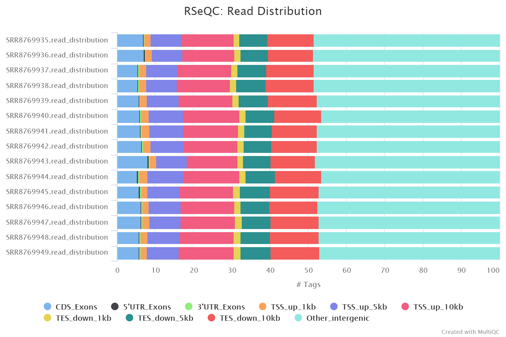

```{r setup, include=FALSE}
knitr::opts_chunk$set(echo = TRUE)
```

# Final project  
**Differential Regulation Network-based Quantification and Prioritization of Key Genes Underlying Cancer Drug Resistence Based on Time-course RNA-Seq Data**
https://doi.org/10.1371/journal.pcbi.1007435

## Introduction  


## Method  
### Library Preparation  
The RNA-Seq data is generated by Dr. Xingcheng Liu, who help culture cell, prepare the RNA library and get sequencing data. The name can be found on the NCBI RNA data website and also in the Ackwonledge section.

Beads containing oligo (dT) were used to isolate poly(A) mRNA from total RNA. Purified mRNA was then fragmented in fragmentation buffer. Using these short fragments as templates, random hexamer-primers ere used to synthesize the first-strand cDNA. The second-strand cDNA was synthesized using buffer, dNTPs, RNase H and DNA polymerase I. Short double-stranded cDNA fragments were purified with a QIAquick PCR extraction kit (vendor) and eluted with EB buffer for end repair and the addition of an ‘A’ base. 

RNA libraries were prepared for sequencing using standard Illumina protocols. The short fragments were ligated to Illumina sequencing adaptors. DNA fragments of a selected size were gel-purified and amplified by PCR.

### Download RNA-Seq Data  
Cell lines are epithelial brain cancer glioma cells: LN-18, U87 and DBTRG-05MG. They are treated with 1mM cAMP activator dbcAMP and data collected at 0, 12, 24, 36, 48h.  
Accession number: **GSE128722**  

```{r}
Samples <- paste0(rep("SRR87699",15),c(35:49))
Cells <- c(rep("DBTRG",5),rep("U87",5),rep("LN18",5))
Time <- rep(c(0,6,12,24,48),3)
Info <- data.frame(Samples=Samples, Cells=Cells, Time=Time)
print(Info)
```

Download a summary file that contains all the *SRR* files called **SRR_Acc_List.txt** and retrieve all the *SRR* files via SRAtoolkits. All the *SRR* files are split into 2 files that are pair-end.  

```{}
prefetch $(cat SRR_Acc_List.txt)  

for(i=35;i<=49;i++)  
do  
	fasterq-dump --split-3 SRR87699${i}  
	rm SRR87699${i}.sra  
done  
```

### Quality Control  

Run FastQC on all samples and use multiqc to visualize all the results.

```{}
mkdir FastQC  
fastqc -o ./FastQC *fastq --extract  

cd FastQC  
mkdir multiqc  
multiqc ./ -o ./multiqc  
```

#### Problems encounted:  

1. When use SRA Analysis to see **Taxonomy Analysis**, found that there is a strong signal of Mycoplasma hyorhinis contamination. Although the percentage is not high, it has a high coverage over 50. Other samples also have different extent of contamination, but not with Mycoplasm highest.

2. Check the FastQC report of the first sample and found that there is a very high percentage of duplicated sequence up over 50%. Use NCBI Blast to check the origin of those highly overrepresented reads, results show that they are all from human Mitochondria ATP8 (ATP synthase F0 subunit 8) genes.

#### Mutltiqc Results  

-From *Seqence Counts*, all the samples are nearly of the same level, must all of them have a very high duplication level, over 50%, except one sample **SRR8769949_2**.  
-However from *Mean Quality Scores* I found that **SRR8769949_2** has lower and more fluctuating scores.  
-Also from *Per Sequence Quality Scores* it has minor peak at Phred 32, while others just have one major peak.  
-From *Per Base N content* I saw that sample has tree peaks at 38, 48, 62-64 bp with a percentage of 1.88%.

The above evidents show that in fact sample **SRR8769949_2** was of low sequencing quality with relative low scores and N content, despite it had low duplication level.

By looking for references, Mycoplasmas are notoriously common contamination for cell culture becuase it is so flexible to pass through most filter membranes and can reach a high concentration without cause any disturbance. It has a small genome size (0.6 Mbp) but lack genes for precursors synthesis and energy metabolism. Thus may alter the host's cell biology. In this case, Mycoplasma hyorhinis endonucleases can degrade host cell DNA, providing DNA precursors for the parasite.  
https://www.ncbi.nlm.nih.gov/pmc/articles/PMC4357728/

In terms of PolyA selection, it is very likely to enrich mt-rRNA and mt-mRNA which is also rich of AT.

### Preprocess

Use trim_galore to filter out all the low quality reads. If a read have a low mean quality, the mate read would also be dropped.

```{}
mkdir trim_fastq  

for((i=35;i<=49;i++))  
do  
trim_galore --paired --retained --stringency 10 -o /.trim_fastq ./raw_fastq/SRR87699${i}_1.fastq ./raw_fastq/87699${i}_2.fastq  
done  
```

Here *--paired* indicates trimming sequence in paired mode, which enables trim_galore to check the two paired reads at the same time and if one read are abandoned, the other would be abandoned as well. *--retained* indicates retaining the bandoned reads. *stringency* is set as 10 to only consider a sequence as adaptor when more than 10 bases are overlapped.

To check results after trimming, run FastQC on the trimmed data. Then run multiqc.

```{}
mkdir FastQC_trimmed  
fastqc -o ../FastQC_trimmed $(ls | grep val) --extract  

cd ../FastQC_trimmed  
mkdir multiqc  
multiqc ./ -o ./multiqc  
```

### Process results

By a simple trimming step, the contamination and duplicate issue are still there, since we just improve the overall quality of reads.

There are improvements on **Per Base Sequence Quality** and **GC content**.


### alignment

Alignemt step is implemented by STAR.

```{}
mkdir alignments  

for((i=35;i<=49;i++))  
do  
STAR --runMode alignReads \
     --runThreadN 8 \
     --genomeDir STARindex \
     --readFilesIn SRR87699${i}_1_val_1.fq SRR87699${i}_2_val_2.fq \
     --outFileNamePrefix alignments/SRR878699${i}. \
     --outSAMtype BAM SortedByCoordinate
done  
```

Perform alignment QC by RseQC.

There is no corresponding BED file in Ensembl, so I generate my own BED file and from gtf annotation and .bai file from .bam file.

```{}
cat ./Homo_sapiens.GRCh38.99.gtf | awk 
samtools index ./alignments/*bam
```

Perform read_distribution and geneBody_coverage analysis.

```{}
ln -s /athena/angsd/scratch/zhc4002/angsd/final  
spack load -r singularity@2.6.0  
RSEQC_IMAGE="/athena/angsd/scratch/simg/rseqc-3.0.1.simg"  
BED_FILE="./Homo_Sapiens.GRCh38.bed"  

for((i=35;i<=49;i++))  
do  
singularity exec $RSEQC_IMAGE read_distribution.py -r $BED_FILE -i ./alignments/SRR87699${i}.Aligned.sortedByCoord.out.bam > ./alignment_qc/SRR87699${i}.read_distribution.txt  

singularity exec $RSEQC_IMAGE geneBody_coverage.py -r $BED_FILE -i ./alignments/SRR87699${i}.Aligned.sortedByCoord.out.bam -o ./alignment_qc/SRR87699${i}
done
```

Use multiqc again to inspect the alignment results. Results are shown as below:  



We can see from the figure that there are less than 10


### Feature counts

Use featureCounts to summarize the mapped reads information.

```{}
spack load subread

featureCounts -p -B -T 8 -t exon -g gene_id -a Homo_sapiens.GRCh38.gtf -o counts.txt ./alignments/*bam
```

Results shown that all samples has an assigned rate over 76%.

```{r, message=F, echo=F}
library(ggplot2)
library(tidyr)
library(magrittr)
library(dplyr)

summary <- read.csv("./counts.txt.summary", header = T, sep='\t')
colnames(summary) <- c("Status", samples)
summary <- gather(data = summary,
                  key = "samples",
                  value = "Nreads",
                  "DBTRG_1":"LN18_5")
summary <- summary[which(summary$Nreads!=0),]

gene_count <- read.csv("./counts.txt", header = T, sep = '\t')
dim(gene_count)
  
gene_count <- gene_count[,-c(2:6)]
samples <- paste0(Cells, "_", rep(c(1:5),3))
colnames(gene_count) <- c(colnames(gene_count)[1], samples)

gene_count_df <- gather(data = gene_count,
                        key = "samples",
                        value = "Nreads",
                            "DBTRG_1" : "LN18_5")
gene_count_df$cells <- gsub("_[0-9]", "", gene_count_df$samples)
gene_count_df <- gene_count_df[which(gene_count_df$Nreads!=0),]

ggplot(summary, aes(fill=Status,y=Nreads,x=samples)) + geom_bar(position="dodge", stat="identity") + coord_flip() + theme(legend.position = "bottom") + labs(title = "featureCounts Summary Statistics")

mean_read <- gene_count_df %>% group_by(cells) %>% summarise(Nreads = mean(Nreads))

ggplot(mean_read, aes(x=cells, y=Nreads)) + geom_bar(stat = "identity") + labs(title = "Mean Number of Read for Each Cell Lines")

#ggplot(gene_count_df, aes(x=cells, y=Nreads)) + geom_point() + labs(title = "Read Distribution for each")

ggplot(gene_count_df, aes(x=log(Nreads+1), fill=cells))+ geom_histogram(alpha = 0.6, position = "identity") + labs(title = "Read Distribution for each")
```

## Results  

### dendrogram

### PCA

### DESeq

### Modeling


## Discussion  


## Conclusion  

